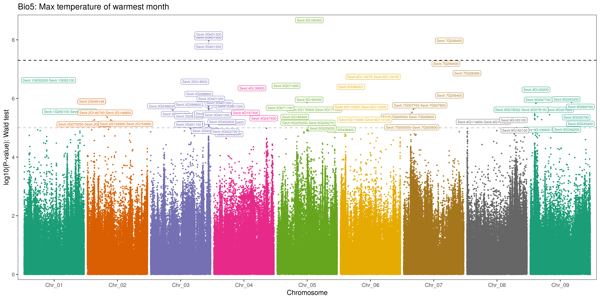
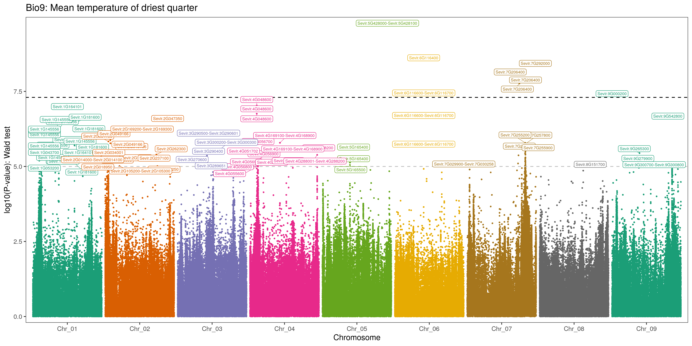
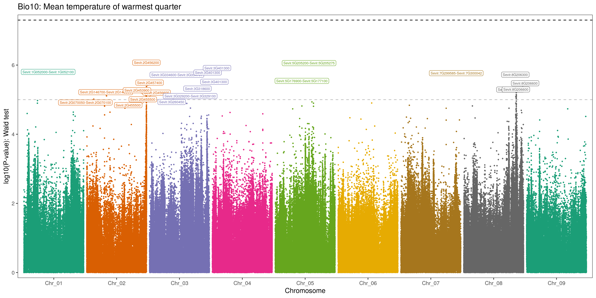
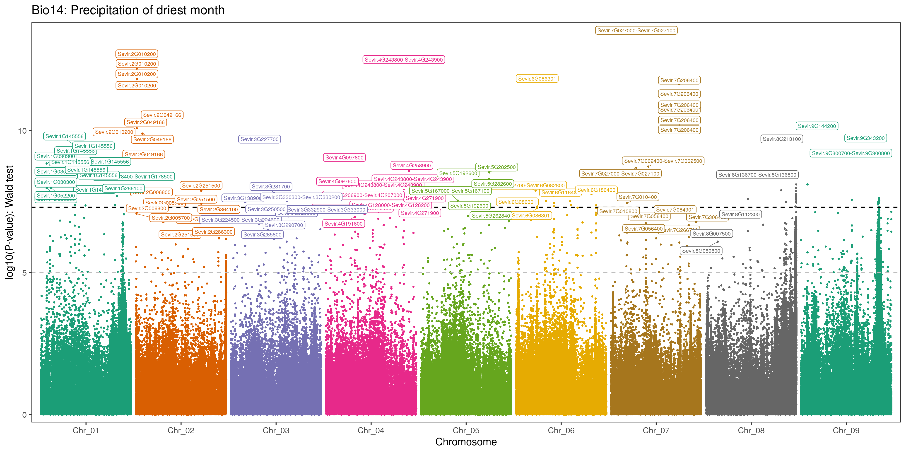
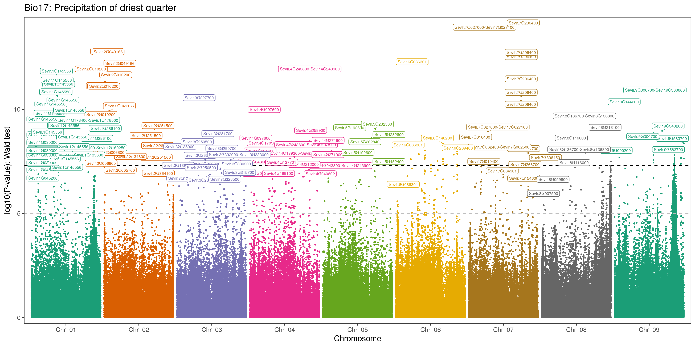
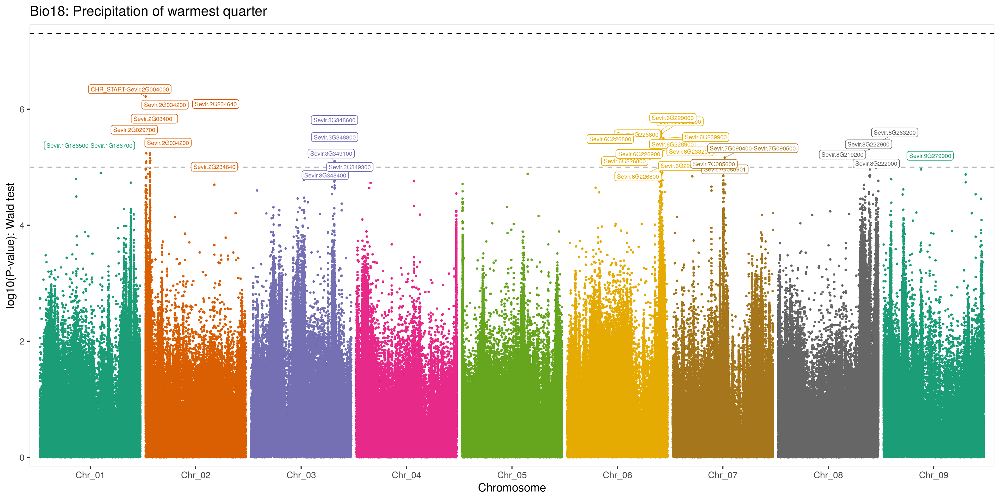

### Compact and indexing vcf file
Compacting VCF file to gz

```console
bgzip -c 12.Setaria_598g_8.58M_withRef_imp_phased_maf0.01_FINAL.vcf > \
   12.Setaria_598g_8.58M_withRef_imp_phased_maf0.01_FINAL.vcf.gz

```


### Filtering variants by minimum allele frequency (MAF) 0.05

```console
bcftools view -q 0.05 Setaria_597g_8.58M.toShare.vcf.gz | \
   sed 's/\//\|/g' | \
   bgzip -c > Setaria_597g_8.58M.toShare-maf-0.05.vcf.gz
```

Tabix is part of samtools package, to install it just type the following command:

```console
sudo apt install samtools
```

```console
tabix -p vcf Setaria_597g_8.58M.toShare-maf-0.05.vcf.gz
```

### Convertion of VCF to Bimbam format

```console
qctool -g Setaria_597g_8.58M.toShare-maf-0.05.vcf.gz \
   -ofiletype bimbam_dosage \
   -og Setaria_597g_8.58M.toShare-maf-0.05-BIMBAM.txt
```


#### Perform genome wide association study analysis with Gemma

```console
for i in {1..19}; do
   cut -f${i} Bio-data-Setaria.txt > Bio${i}-data-Setaria.txt
   docker run --rm -v `pwd`:`pwd` pgcbioinfo/gemma gemma \
      -g `pwd`/Setaria_597g_8.58M.toShare-maf-0.05-phased-BIMBAM.txt \
      -p `pwd`/Bio${i}-data-Setaria.txt \
      -gk \
      -outdir `pwd`/ \
      -o Setaria_597g_8.58M.toShare-maf-0.05-phased-BIMBAM-kinship-${i}

   docker run --rm -v `pwd`:`pwd` pgcbioinfo/gemma gemma \
      -g `pwd`/Setaria_597g_8.58M.toShare-maf-0.05-phased-BIMBAM.txt \
      -p `pwd`/Bio${i}-data-Setaria.txt \
      -k `pwd`/Setaria_597g_8.58M.toShare-maf-0.05-phased-BIMBAM-kinship-${i}.cXX.txt \
      -lmm \
      -outdir `pwd`/ \
      -o Setaria_597g_8.58M.toShare-maf-0.05-phased-GEMMA-Bio-${i}
   rm -f Bio${i}-data-Setaria.txt
done
```

```console
for i in raw/*.txt; do 
   BIO=$(echo $i | sed -E 's/raw|.txt//g'); 
   sed 's/-9\t//' raw/${BIO}.txt | \
      sed 's/:/\t/' | \
      sed 's/_/./' | \
      sed 's/_.*\tChr/\tChr/' | \
      sed 's/\./_/' | \
      sed 's/\tChr.*:/\t/' > raw-formatted/${BIO}-Formatted.txt
done
```

```console
for i in raw-formatted/*.txt; do 
   BIO=$(echo $i | sed -E 's/raw-formatted\/|.txt//g'); 
   java -jar /media/lgmbv/HD-6Tb/Softwares/snpEff/snpEff.jar \
      -v Setaria_viridis raw-formatted/${BIO}.txt > \
      raw-formatted-annotated/${BIO}-Effect-predicted.txt
done
```

```console
for i in raw-formatted-annotated/*.txt; do 
   LIB=$(echo $i | sed -E 's/raw-formatted-annotated\/|.txt//g');
   sed 's/;/\t/' raw-formatted-annotated/${LIB}.txt | \
      grep -v "#" | \
      awk '{print $1"\t"$2"\t"$3"\t"$4"\t"$5"\t"$6"\t"$7"\t"$8"\t"$10"\t"$11"\t"$12"\t"$13"\t"$9}' | \
      sed -E 's/ANN.|\|/\t/g' | \
      cut -f1-12,15-17 | \
      sed 's/SEVIR_/Sevir./g' | \
      sed 's/v2//g' | \
      sed 's/v2-/-/' > raw-formatted-annotated-final/${LIB}-formatted.txt;
done
```

BioClimate | Description                             | \# of variants  | \# of genic variants | High impact | Intergenic region 
---------- | -----------------------                 | --------------: | -----:   | -----: | ----------------:
Bio 1      | Annual mean temperature                 | 644             | 535      | 7      | 109
Bio 2      | Mean diurnal range                      | 870             | 747      | 5      | 123
Bio 3      | Isothermality                           | 283             | 220      | 8      | 63
Bio 4      | Temperature seasonality                 | 657             | 473      | 11     | 184
**Bio 5**  | **Max temperature of warmest month**    | **74**          | **54**   | **2**  | **20**
Bio 6      | Min temperature of coldest month        | 766             | 594      | 12     | 172
Bio 7      | Temperature annual range                | 206             | 165      | 2      | 41
Bio 8      | Mean temperature of wettest quarter     | 569             | 530      | 8      | 39
**Bio 9**  | **Mean temperature of driest quarter**  | **109**         | **94**   | **0**  | **15**
**Bio 10** | **Mean temperature of warmest quarter** | **34**          | **26**   | **1**  | **8**
Bio 11     | Mean temperature of coldest quarter     | 839             | 654      | 13     | 185
Bio 12     | Annual precipitation                    | 169             | 155      | 1      | 14
Bio 13     | Precipitation of wettest month          | 9               | 9        | 0      | 0
**Bio 14** | **Precipitation of driest month**       | **2533**        | **1995** | **39** | **538**
Bio 15     | Precipitation seasonality               | 1805            | 1065     | 9      | 740
Bio 16     | Precipitation of wettest quarter        | 11              | 10       | 0      | 1
**Bio 17** | **Precipitation of driest quarter**     | **2808**        | **2247** | **37** | **561**
**Bio 18** | **Precipitation of warmest**            | **48**          | **45**   | **1**  | **3**
Bio 19     | Precipitation of coldest quarter        | 477             | 363      | 5      | 114

Tables for selected climatic variables are listed below:
GWAS results table for the [Max temperature of warmest month](https://docs.google.com/spreadsheets/d/1_dVaFRDJoFhYn85vug2NaESx5otR1QJX7rjOv4yTmGI/edit?usp=sharing "Max temperature of warmest month").



GWAS results table for the [Mean temperature of driest quarter](https://docs.google.com/spreadsheets/d/1DPEKOXzXkIVw3YTgV98Mpx9_ha4qFnh5DQ9v1OY46HQ/edit?usp=sharing "Mean temperature of driest quarter").



GWAS results table for the [Mean temperature of warmest quarter](https://docs.google.com/spreadsheets/d/1ROAgsESi7TLK8z0iIMr2MgNqOuhmLD3qcgjHLdOyPQ0/edit?usp=sharing "Mean temperature of warmest quarter").



GWAS results table for the [Precipitation of driest month](https://docs.google.com/spreadsheets/d/1LFDevt2lZSQfHE5m0O_z1UF6MvQsPalecljLX-D356w/edit?usp=sharing "Precipitation of driest month").



GWAS results table for the [Precipitation of driest quarter](https://docs.google.com/spreadsheets/d/1UobR173cVt5ec4xRGx6_aKcGUdENbMTOh7cV5UGLAfg/edit?usp=sharing "Precipitation of driest quarter").



GWAS results table for the [Precipitation of warmest quarter](https://docs.google.com/spreadsheets/d/1y_f0EMf8f_WLJfjOqaP-yczLiHUD1wsEFsdfXY2pCEY/edit?usp=sharing "Precipitation of warmest quarter").



